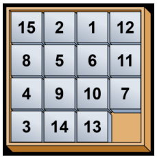
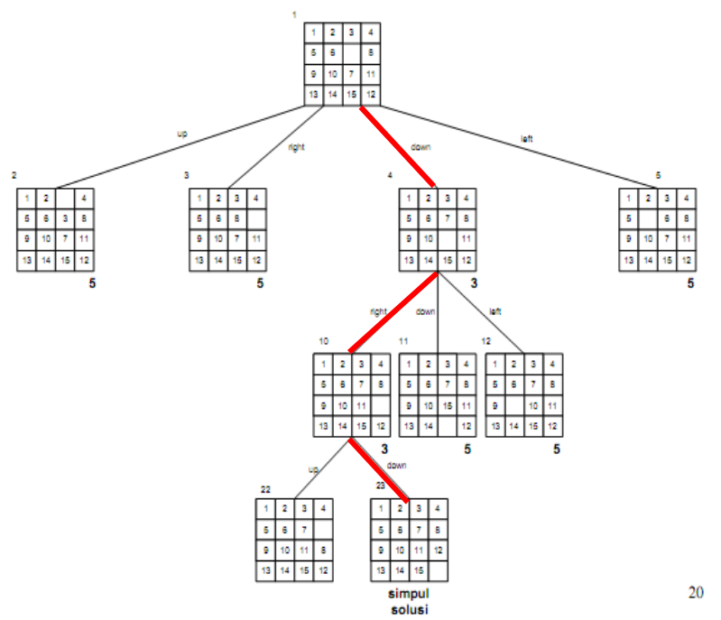

# PUZZLE-15 SOLVER
Penyelesaian Puzzle-15 Game Board menggunakan algorima Branch & Bound

## Deskripsi Singkat

Pada Tucil kali ini akan dibuat sebuah program problem solving dari Game Board Puzzle-15. Puzzle-15 Game Board adalah Game berbentuk matrix berukuran 4 x 4. Semua kotak di dalam matrix diisi dengan angka dari 1 sampai 15 dan disisihkan 1 kotak kosong. Player diminta untuk memindahkan balok-balok angka ke kotak kosong sedemikian rupa sehingga dapat mencapat GOAL_STATE, yaitu balok angka-angka terurut membesar dan kotak kosong berada pada kotak terakhir



## Requirement Program
Interpreter:
- python

Library:
- copy
- random
- time
- msvcrt

## Instalasi
Clone repositori ini dengan menggunakan command pada terminal:  
```
git clone https://github.com/Amike31/Tucil_Stima_3
```

## Menjalankan Program
### Menggunakan Source Code
- Masuk ke dalam folder hasil clone
- Jalankan program menggunakan command berikut:  
```
cd src ; py Main.py
```
- Setelah program berjalan, akan disediakan 3 buah cara pengambilan Puzzle-15 yang berbeda. Anda dapat memilih cara masukan yang diinginkan dan akan diarahkan melalui UI program.

## Output Program
* Setelah melakukan pemilihan cara masukan dan masukan puzzle, akan ditampilkan beberapa hal sebagai berikut:
    * Tabel KURANG(i)
    * Hasil Bounding_Function
    * Langkah-Langkah penyelesaian
    * Path yang dilalui
    * Waktu Eksekusi Implementasi Algoritma B&B
    * Banyak simpul yang dibangkitkan (simpul hidup)
    * Banyak langkah yang dibutuhkan

### Pengujian Author
Terdapat beberapa dataset Puzzle-15 di folder "test", Anda dapat memakainya sebagai dummy file.

## Author
Rahmat Rafid Akbar - 13520090
K03